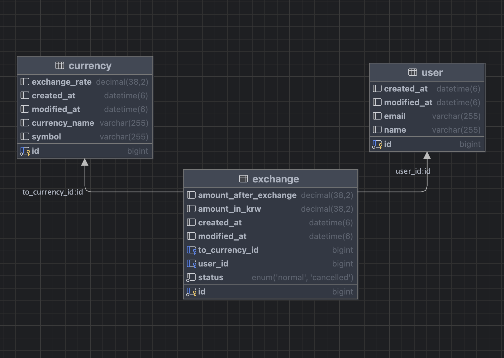

# 환전 API 명세서

## 환전 API
| 기능     | 메서드    | URL                           | 요청형식 | 응답형식 | 상태코드      
|--------|--------|-------------------------------|----|------|-----------|
환전등록   | POST   | /exchanges                    | json | json | 200: Ok , 404: Not found
환전 전체목록 찾기 | GET    | /exchanges/{userId}           | X   | json | 200: Ok , 404: Not found
환전 총 횟수찾기 | GET    | /exchanges/summaries/{userId} | X   | json | 200: Ok , 404: Not found
환전상태 수정   | PUT    | /exchanges/{exchangeId}       | X | json | 200: Ok , 404: Not found
유저정보 삭제   | DELETE | /exchanges/{userId}           | X | X    | 200: Ok , 404: Not found


## 1. POST

### 1-1 환전 요청예시
```
POST /exchanges 
{
    "userId" : 1,             // 유저아이디
    "currencyId" : 2,         // 화폐단위아이디
    "amountInKrw" : 9170      // 환전하고자 하는 돈 (한국돈)
}
```
### 1-2 환전 등록 응답예시
```
{
    "id": 5,
    "userId": 1,
    "currencyId": 2,
    "amountInKrw": 9170,
    "currencyRate": 917.00,            // 환율
    "amountAfterExchange": "10.00円",   // 환전 후 금액
    "status": "NORMAL"                 // 상태
}
```

## 2. GET
```
GET /exchanges/{userId}      // 유저의 모든 환전 정보 찾기

GET /exchanges/summaries/{userId}   // 유저의 총 환전금액 찾기
```
### 2-1 환전 전체 조회 응답예시
```
[
    {
        "id": 5,                           // 환전 고유아이디
        "userId": 1,                       // 유저아이디
        "currencyId": 2,                   // 통화단위
        "amountInKrw": 9170.00,            // 원하는 환전금액
        "currencyRate": 917.00,            // 환율
        "amountAfterExchange": "10.00円",   // 환전 후 금액
        "status": "NORMAL"                 // 상태
    },
    {
        "id": 5,
        "userId": 1,
        "currencyId": 2,
        "amountInKrw": 9170.00,
        "currencyRate": 917.00,
        "amountAfterExchange": "10.00円",
        "status": "NORMAL"
    }
]
```
### 2-2 환전횟수 찾기 응답예시
```
[
    {
        "userId": 1,                  // 유저아이디
        "count": 2,                   // 해당유저의 총 환전 횟수
        "totalAmountInKrw": 18340.00  // 총 환전 금액
    }
]
```

## 3. PUT

### 3-1 환전상태수정 요청 예시
```
PUT /exchanges/{exchangeId}
```
### 3-2 환전상태수정 응답 예시
```
{
    "exchangeId": 1,          // 환전정보 아이디
    "status": "CANCELLED"     // 상태
}
```


## 4. DELETE
### 4-1 환전 유저 삭제 요청예시
```
DELETE /exchanges/{userId}
```

# ERD

